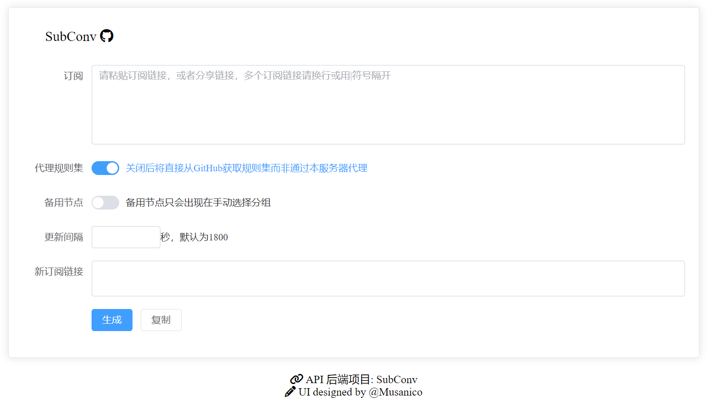

# Subscription Converter

[English](README.md) | 中文

 

~~这个项目是面向所有Clash用户的订阅转换，如果你需要ZJU专版，请移步[SubConv 4 ZJU](https://github.com/SubConv/SubConv-4-ZJU)~~

我们提供了一般用户的配置和ZJU专版的配置，可查看 [docs](https://subconv.is-sb.com) 了解如何使用对应的配置文件部署。

## 截图

## 功能

- 支持Clash配置和V2ray格式的base64链接（即原始订阅不一定是Clash）
- 自带Web-UI (感谢 [@Musanico](https://github.com/musanico))
- 大体基于 ACL 的规则
- 基于 proxy-provider 的节点自动更新
- 基于 rule-provider 的规则自动更新
- 支持代理 rule-provider 防止无法从 GitHub 获取规则集
- 多机场用户提供了支持
- 剩余流量和总流量的显示（单机场的时候才有用，需要你的机场和你用的Clash同时支持，已知Clash for Windows, Clash Verge, Stash, Clash Meta for Android等已支持）
- 实现了订阅转换成 proxy-provider 的 api, (一般人也不会去用吧)
- 支持配置文件

## 文档

[docs](https://subconv.is-sb.com) (中英都有, 但是机翻)

## 说明

**Clash Core from Dreamacro** (原版Clash) 已经不再支持了，建议使用 [mihomo](https://github.com/MetaCubeX/mihomo)

## 食用方法

自己根据 [文档](https://subconv.is-sb.com) 部署

## 为本项目贡献

欢迎 issue 和 PR。如果要提pr请从main分支开新分支然后提pr到dev分支，或者也可以先把main合并到dev然后在dev里改，最后提pr到dev

## 致谢

- [subconverter](https://github.com/tindy2013/subconverter)
- [mihomo](https://github.com/MetaCubeX/mihomo)
- ~~[Proxy Provider Converter](https://github.com/qier222/proxy-provider-converter)~~

## 许可证

本项目采用 [MPL-2.0 License](https://github.com/SubConv/SubConv/blob/main/LICENSE) 分发
