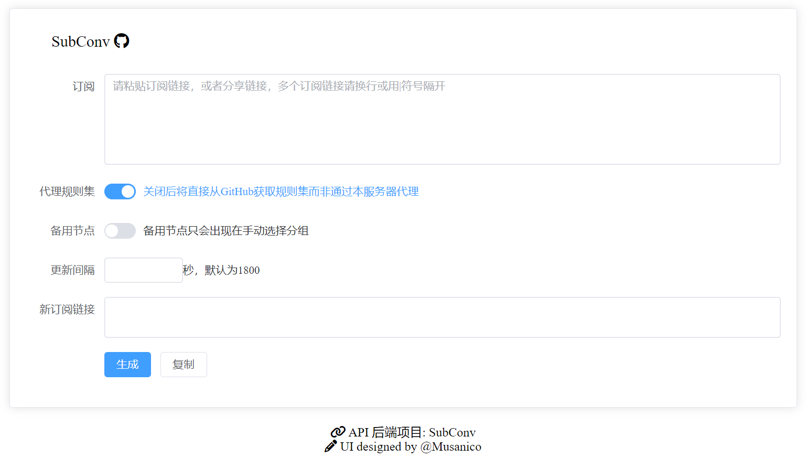

# Subscription Converter

[English](README.md) | 中文

 

这是一个将订阅转换为 mihomo 兼容配置的项目。

仓库根目录下自带两套模板：`template/zju.yaml` 和 `template/general.yaml`。Web UI 默认使用 `zju`，API 在不传 `template` 查询参数时也默认使用 `zju`。仓库提供 `config.yaml.example` 作为默认运行时配置。

## 截图

## 功能

- 支持Clash配置和V2ray格式的base64链接（即原始订阅不一定是Clash）
- 自带Web-UI (感谢 [@Musanico](https://github.com/musanico))
- 大体基于 ACL 的规则
- 基于 proxy-provider 的节点自动更新
- 支持为指定 proxy-provider 强制使用 `DIRECT` 更新
- 基于 rule-provider 的规则自动更新
- 支持代理 rule-provider 防止无法从 GitHub 获取规则集
- 多机场用户提供了支持
- 剩余流量和总流量的显示（单机场的时候才有用，需要你的机场和你用的Clash同时支持，已知Clash for Windows, Clash Verge, Stash, Clash Meta for Android等已支持）
- 实现了订阅转换成 proxy-provider 的 api, (一般人也不会去用吧)
- 支持模板文件

## 文档

[docs](https://subconv.is-sb.com) (中英都有, 但是机翻)

## 仓库结构

- `subconv/`：FastAPI 后端与转换逻辑
- `api.py`：供 CLI 和 Vercel 使用的薄入口
- `config.yaml.example`：运行时配置示例；用户改动应放在 `config.yaml`
- `template/`：运行时 YAML 模板（默认 `zju.yaml`，可选 `general.yaml`）
- `mainpage/`：Vue/Vite 前端
- `docs/`：VitePress 文档站点，通过 GitHub Pages 独立部署

本地常用命令（需安装 [uv](https://docs.astral.sh/uv/) 和 [bun](https://bun.sh)）：

- 后端：`uv sync` 后，可先把 `config.yaml.example` 复制成 `config.yaml`（推荐；仓库自带的 `docker-compose.yml` 也要求它存在），按需修改后执行 `uv run python api.py`
- 前端：`cd mainpage && bun install && bun run dev`
- 文档：`cd docs && bun install && bun run dev`

## 说明

**Clash Core from Dreamacro** (原版Clash) 已经不再支持了，建议使用 [mihomo](https://github.com/MetaCubeX/mihomo)

## 食用方法

自己根据 [文档](https://subconv.is-sb.com) 部署

## 为本项目贡献

欢迎 issue 和 PR。如果要提pr请从main分支开新分支然后提pr到dev分支，或者也可以先把main合并到dev然后在dev里改，最后提pr到dev

## 致谢

- [subconverter](https://github.com/tindy2013/subconverter)
- [mihomo](https://github.com/MetaCubeX/mihomo)
- ~~[Proxy Provider Converter](https://github.com/qier222/proxy-provider-converter)~~

## 许可证

本项目采用 [MPL-2.0 License](https://github.com/SubConv/SubConv/blob/main/LICENSE) 分发
